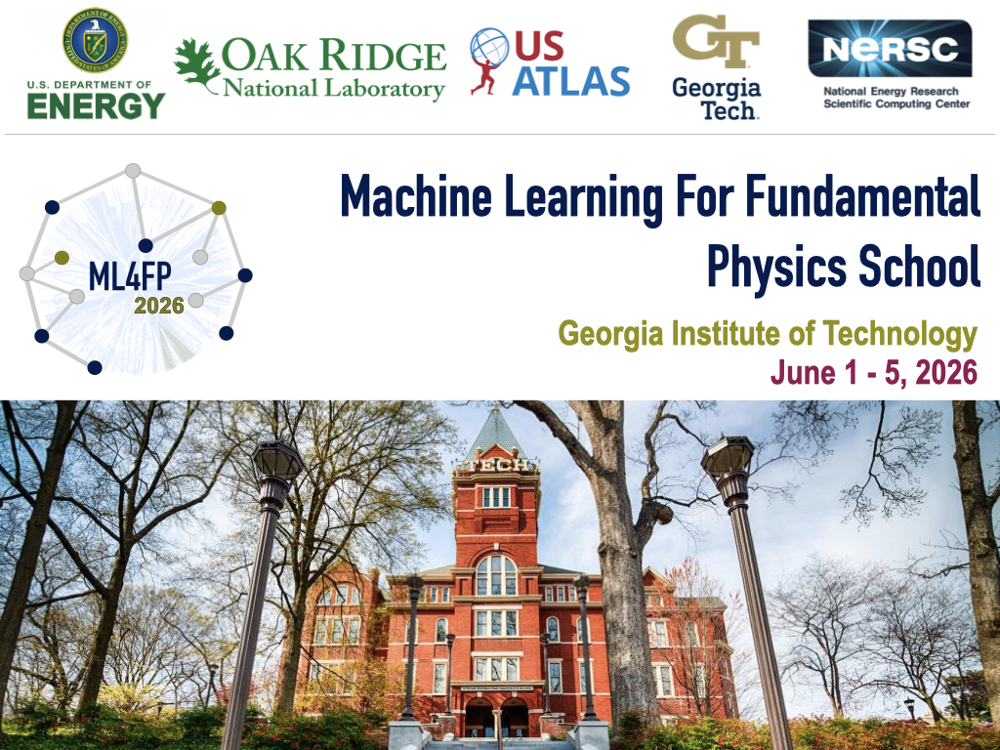

<figure>
  
</figure>

The Machine Learning for Fundamental Physics (ML4FP) School 2026 will be hosted at the Georgia Institute of Technology.
All talks and tutorials will be given in person, and participants can register to participate in-person or virtually. 
After two highly successful US ATLAS Machine Learning (ML) training events in 2022 and 2023, followed by two successful ML4FP event in 2024 and 2025 
we are excited to continue this pattern. This event remains open to all particle physicists. Similar to last year, this year the program is open to all of particle physics.

 The US ATLAS ATC program supports domestic travel and accommodation for US ATLAS early career researchers. Additional funding from the DOE / ORNL supports domestic travel for other early career researchers. These participants will be offered lodging in Georgia Tech students apartments located in Midtown Atlanta.
 NERSC will provide training accounts with GPU nodes for registered participants.

 

 <a href="https://indico.global/event/17000/" target="_blank">
  <button style="
    background-color: #0056b3; 
    color: white; 
    padding: 10px 15px; 
    border: none; border-radius: 999px;
   text-decoration: none;
   font-family: sans-serif;
  ">
    Link to the Indico page
  </button>
</a> 